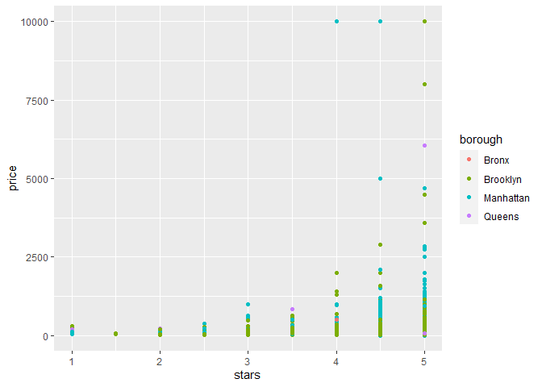
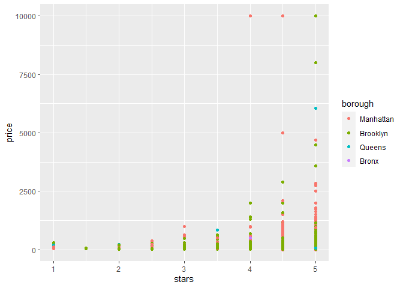
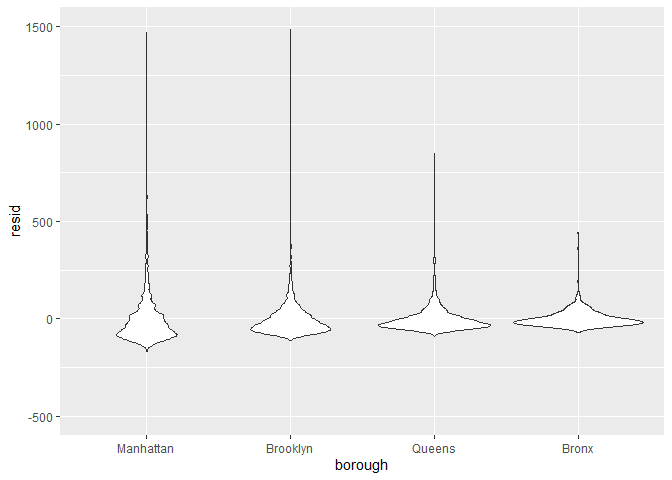
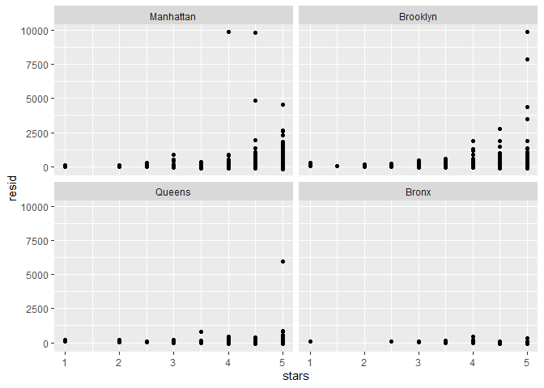

linearmodel
================
Yuchen Hua
2022-11-25

``` r
data("nyc_airbnb")

nyc_airbnb = 
  nyc_airbnb %>% 
  mutate(stars = review_scores_location / 2) %>% 
  rename(
    borough = neighbourhood_group,
    neighborhood = neighbourhood) %>% 
  filter(borough != "Staten Island") %>% 
  select(price, stars, borough, neighborhood, room_type)
```

## fit a model

``` r
nyc_airbnb %>%
  ggplot(aes(x = stars, y= price, color = borough))+
  geom_point()
```

    ## Warning: Removed 9962 rows containing missing values (`geom_point()`).

<!-- -->

Let’s fit the model

Let’s look at the result better …(tidy out result)

``` r
broom::glance(fit)
```

    ## # A tibble: 1 × 12
    ##   r.squared adj.r.…¹ sigma stati…²   p.value    df  logLik    AIC    BIC devia…³
    ##       <dbl>    <dbl> <dbl>   <dbl>     <dbl> <dbl>   <dbl>  <dbl>  <dbl>   <dbl>
    ## 1    0.0342   0.0341  182.    271. 6.73e-229     4 -2.02e5 4.04e5 4.04e5  1.01e9
    ## # … with 2 more variables: df.residual <int>, nobs <int>, and abbreviated
    ## #   variable names ¹​adj.r.squared, ²​statistic, ³​deviance

``` r
broom::tidy(fit) %>%
  select(-std.error, -statistic) %>%
  mutate(
    term = str_replace(term, "borough", "Borough:")
  ) %>%
  knitr::kable(digits = 3)
```

| term              | estimate | p.value |
|:------------------|---------:|--------:|
| (Intercept)       |  -70.414 |   0.000 |
| stars             |   31.990 |   0.000 |
| Borough:Brooklyn  |   40.500 |   0.000 |
| Borough:Manhattan |   90.254 |   0.000 |
| Borough:Queens    |   13.206 |   0.145 |

## Be in control of factors

``` r
nyc_airbnb = 
  nyc_airbnb %>%
  mutate(
    borough = fct_infreq(borough),
    room_type = fct_infreq(room_type)
  )
```

Look at that plot again

``` r
nyc_airbnb %>%
  ggplot(aes(x = stars, y= price, color = borough))+
  geom_point()
```

    ## Warning: Removed 9962 rows containing missing values (`geom_point()`).

<!-- -->

``` r
fit = lm(price ~stars + borough, data = nyc_airbnb)

broom::tidy(fit)
```

    ## # A tibble: 5 × 5
    ##   term            estimate std.error statistic   p.value
    ##   <chr>              <dbl>     <dbl>     <dbl>     <dbl>
    ## 1 (Intercept)         19.8     12.2       1.63 1.04e-  1
    ## 2 stars               32.0      2.53     12.7  1.27e- 36
    ## 3 boroughBrooklyn    -49.8      2.23    -22.3  6.32e-109
    ## 4 boroughQueens      -77.0      3.73    -20.7  2.58e- 94
    ## 5 boroughBronx       -90.3      8.57    -10.5  6.64e- 26

``` r
broom::glance(fit)
```

    ## # A tibble: 1 × 12
    ##   r.squared adj.r.…¹ sigma stati…²   p.value    df  logLik    AIC    BIC devia…³
    ##       <dbl>    <dbl> <dbl>   <dbl>     <dbl> <dbl>   <dbl>  <dbl>  <dbl>   <dbl>
    ## 1    0.0342   0.0341  182.    271. 6.73e-229     4 -2.02e5 4.04e5 4.04e5  1.01e9
    ## # … with 2 more variables: df.residual <int>, nobs <int>, and abbreviated
    ## #   variable names ¹​adj.r.squared, ²​statistic, ³​deviance

## Diagnostics

``` r
modelr::add_residuals(nyc_airbnb, fit) %>%
  ggplot(aes(x = borough, y = resid)) +
  geom_violin() +
  ylim(-500, 1500)
```

    ## Warning: Removed 9993 rows containing non-finite values (`stat_ydensity()`).

<!-- -->

or can be written like

``` r
nyc_airbnb %>%
modelr::add_residuals( fit) %>%
  ggplot(aes(x = borough, y = resid)) +
  geom_violin() +
  ylim(-500, 1500)
```

    ## Warning: Removed 9993 rows containing non-finite values (`stat_ydensity()`).

<!-- -->

``` r
nyc_airbnb %>%
  modelr::add_residuals( fit) %>%
  ggplot(aes(x = stars, y = resid)) +
  geom_point() +
  facet_wrap(. ~ borough)
```

    ## Warning: Removed 9962 rows containing missing values (`geom_point()`).

<!-- -->

## Hypothesis test

This does t-test by default

``` r
fit %>%
  broom::tidy()
```

    ## # A tibble: 5 × 5
    ##   term            estimate std.error statistic   p.value
    ##   <chr>              <dbl>     <dbl>     <dbl>     <dbl>
    ## 1 (Intercept)         19.8     12.2       1.63 1.04e-  1
    ## 2 stars               32.0      2.53     12.7  1.27e- 36
    ## 3 boroughBrooklyn    -49.8      2.23    -22.3  6.32e-109
    ## 4 boroughQueens      -77.0      3.73    -20.7  2.58e- 94
    ## 5 boroughBronx       -90.3      8.57    -10.5  6.64e- 26

What about the significantce of ‘borough’

``` r
fit_null = lm(price ~stars, data = nyc_airbnb)
fit_alt = lm(price ~ stars + borough, data = nyc_airbnb)

anova(fit_null, fit_alt) %>%
  broom::tidy()
```

    ## Warning: Unknown or uninitialised column: `term`.

    ## # A tibble: 2 × 7
    ##   term                    df.residual       rss    df   sumsq stati…¹    p.value
    ##   <chr>                         <dbl>     <dbl> <dbl>   <dbl>   <dbl>      <dbl>
    ## 1 price ~ stars                 30528    1.03e9    NA NA          NA  NA        
    ## 2 price ~ stars + borough       30525    1.01e9     3  2.53e7    256.  7.84e-164
    ## # … with abbreviated variable name ¹​statistic
